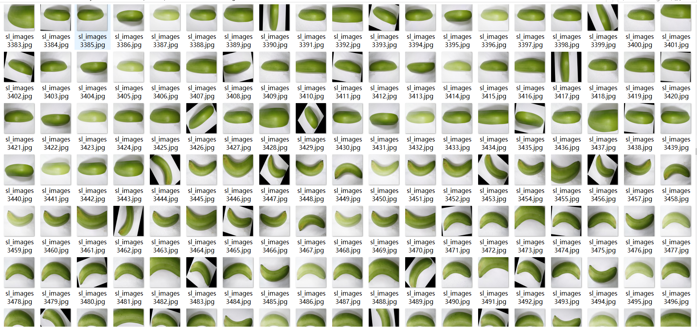
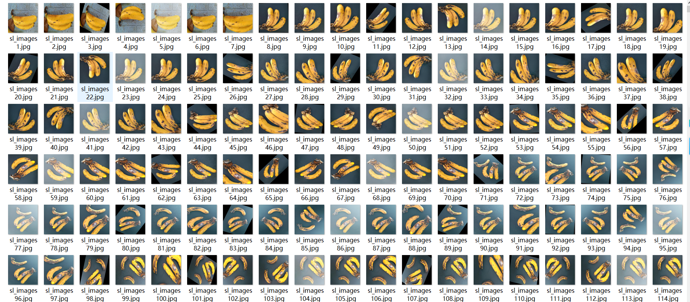
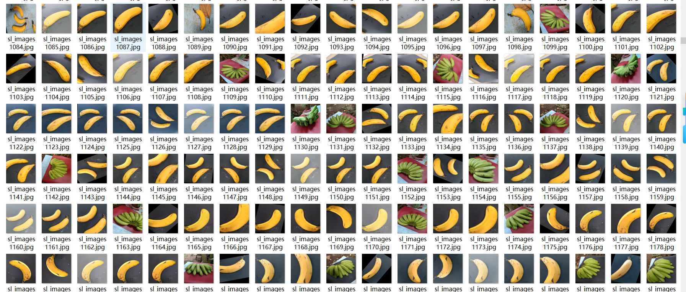

# [Dataset] Banana Ripeness Dataset YOLO-VOC 7544 images（(Augmented) ）

Dataset introduction: Banana ripeness dataset, 7544 images, enhanced, labeled as "freshripe", "freshunripe", "overripe", "ripe", "rotten", "unripe", with clear and bright colors, both Yolo and VOC annotation formats.

Dataset Format: VOC format + YOLO format

The compressed file contains: three folders, each storing images, xml files, and text files.

Total jpg images in JPEGImages folder: 7544

The total number of XML files in the Annotations folder is 7544.

The total number of txt files in the labels folder is 7544.

Number of tag types: 6

Tag names: ["freshripe","freshunripe","overripe","ripe","rotten","unripe"]

Number of boxes per label:

freshripe frame count = 1505

freshunripe frame count = 1991

overripe frame count = 2058

ripe frame count = 3394

rotten frame count = 4119

unripe frame count = 1981

Total boxes: 15048

Picture clarity (Resolution: Pixels): Clear

Is the image enhanced: No

Shape of the label: Rectangular box, used for object detection and recognition.

Important Note: None

Special Notice: This dataset does not guarantee the accuracy or precision of the trained models or weight files. The dataset only provides accurate and reasonable annotations.

## Images

---

Here is a pay link on Stripe (https://buy.stripe.com/3cs8yP7sY87d0vu9AB). Please contact me lonlonago@foxmail.com after funding $89, and I will send you a complete data files, thank you!

